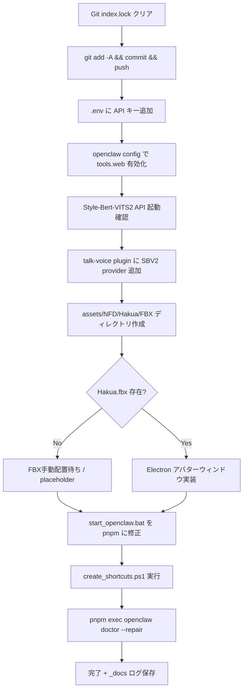

# Clawdbot Full System Setup Plan

## 現状把握

- `.git/index.lock` は現時点で存在しない（node_modules内のlockファイルのみ）
- 修正済みファイル15個 + 未追跡ファイル多数がコミット待ち
- `assets/NFD/Hakua/FBX/Hakua.fbx` は **存在しない** (要手動配置)
- `Style-Bert-VITS2` パスは存在: `C:\Users\downl\Desktop\EasyNovelAssistant\EasyNovelAssistant\Style-Bert-VITS2`
- `extensions/auto-agent/` ディレクトリ存在するが中身が空
- `start_openclaw.bat` は `npm start` を使用（`pnpm start` に修正が必要）

---

## Step 1: Git Commit & Push

**対象ファイル**: 修正済み15ファイル + 未追跡ファイル群（`_docs/`, `src/security/sanitization.ts`, `create_shortcuts.ps1`, `start_openclaw.bat`, etc.）

**手順** (PowerShell、`;` 使用、`&` 不使用):

```powershell
# index.lock の安全なクリア（存在する場合のみ）
Remove-Item ".git\index.lock" -ErrorAction SilentlyContinue

# ステージング（日本語ファイル名はgit addが自動エスケープ）
git add -A

# コミット（ヒアドキュメント相当のPowerShell構文）
git commit -m "feat: autonomy, voice, avatar, security, shortcuts integration"

# プッシュ（upstream/main に対して ahead 15）
git push
```

**注意点**:

- 日本語ファイル名 (`_docs/2026-02-20_自動起動...md` 等) は `git add -A` で一括ステージング
- `%USERPROFILE%/` ディレクトリは `.gitignore` へ追加推奨

---

## Step 2: Autonomy (Internet Access) 設定

**関連ファイル**:

- `[src/agents/tools/web-search.ts](src/agents/tools/web-search.ts)` - Brave/Perplexity/Grok 検索実装
- `[src/agents/tools/web-fetch.ts](src/agents/tools/web-fetch.ts)` - Firecrawl フェッチ実装
- `[.env.example](.env.example)` - 環境変数テンプレート

**設定方法**: `.env` ファイルに以下を追加:

```env
BRAVE_API_KEY=<your_key>          # Web検索（デフォルト）
PERPLEXITY_API_KEY=<your_key>     # Perplexity代替
FIRECRAWL_API_KEY=<your_key>      # Webフェッチ
```

**openclaw config** (`openclaw.config.yaml`) で `tools.web` セクションを有効化:

```yaml
tools:
  web:
    enabled: true
    search:
      provider: brave # or perplexity / grok
    fetch:
      enabled: true
```

**auto-agent プラグイン**: `extensions/auto-agent/` が空のため、`openclaw.plugin.json` を作成してプラグインとして登録する。

---

## Step 3: Voice / Camera 設定

### 3-1. talk-voice / voice-call プラグイン確認

- `[extensions/talk-voice/openclaw.plugin.json](extensions/talk-voice/openclaw.plugin.json)` - 設定スキーマは現在空
- `[extensions/voice-call/src/config.ts](extensions/voice-call/src/config.ts)` - provider: telnyx/twilio/mock

### 3-2. Style-Bert-VITS2 統合

Style-Bert-VITS2 はHTTP API サーバーとして起動可能。`talk-voice` プラグインに Style-Bert-VITS2 プロバイダーを追加:

- Style-Bert-VITS2 API エンドポイント: `http://localhost:5000/voice`
- `extensions/talk-voice/index.ts` に SBV2 プロバイダーハンドラーを追加
- `openclaw.config.yaml` のプラグイン設定:

```yaml
plugins:
  entries:
    talk-voice:
      enabled: true
      config:
        provider: style-bert-vits2
        endpoint: "http://localhost:5000"
        modelId: "Hakua"
```

### 3-3. マイク/カメラ入力マッピング

- `voice-call` プラグインの `inboundPolicy: open` で受信設定
- Windows デバイス名を `voice-call` config の `audioDevice` フィールドにマッピング

---

## Step 4: Desktop Resident Avatar

### 4-1. FBX アセット確認

`assets/NFD/Hakua/FBX/Hakua.fbx` が **存在しない** ため:

- ディレクトリ `assets/NFD/Hakua/FBX/` を作成
- FBX ファイルを手動配置するか、NFD/VRChat から export する必要あり

### 4-2. FBX レンダリング ウィンドウ実装

OpenClaw の Electron ベースまたは独立プロセスとして常駐ウィンドウを実装:

- Three.js + `three/addons/loaders/FBXLoader.js` でFBX読み込み
- `scripts/avatar-window.js` (新規作成) - 透明背景の常駐Electronウィンドウ
- `create_shortcuts.ps1` にアバターウィンドウ起動を追加

---

## Step 5: System Integrity

### 5-1. start_openclaw.bat 修正

```bat
@echo off
title OpenClaw Server
cd /d "%~dp0"
call pnpm start
pause
```

`npm start` → `pnpm start` に変更。

### 5-2. ショートカット作成・テスト

```powershell
# 既存スクリプトを実行
PowerShell -ExecutionPolicy Bypass -File ".\create_shortcuts.ps1"
```

デスクトップと Startup フォルダに `OpenClaw.lnk` が作成される。

### 5-3. Doctor 最終チェック

```powershell
pnpm exec openclaw doctor --deep
```

ウォーニング一覧を確認し、自動修復:

```powershell
pnpm exec openclaw doctor --repair --yes
```

---

## 実装フロー



---

## 重要な確認事項

- **FBX ファイル**: 手動配置が必要。VRChat/NFD から export した `Hakua.fbx` を `assets/NFD/Hakua/FBX/` に置く
- **API キー**: Brave Search / Perplexity / Firecrawl の API キーが別途必要
- **Style-Bert-VITS2**: 統合前に `C:\Users\downl\Desktop\EasyNovelAssistant\EasyNovelAssistant\Style-Bert-VITS2` で API サーバーが起動できることを確認
- **アバターウィンドウ**: Electron が依存関係に含まれているか要確認
